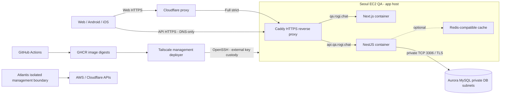

# 로기챗 기반 설계안

상태: 2026-09-20 갱신. MySQL 전환 확정, EC2/Aurora 전환 방향 승인, 신규 자원 생성·검증 완료, API DNS 전환 대기.
확정 요구: 공개 모노레포, QA 우선, AWS 서울, MySQL 호환 DB,
Next.js/NestJS, Kotlin/Swift, Terraform/Atlantis, GitHub Actions/GHCR, Cloudflare DNS.
웹 도메인은 QA `qa.rogi.chat`, prod `rogi.chat`이다. QA API는 `api.qa.rogi.chat`,
prod API는 `api.rogi.chat`을 제안한다. 사용자에게 보이는 제품명은 로기챗으로 통일한다.

## 제품과 초기 범위

후로기 전용 1:N 채팅이 중심이며 프로필·방명록을 결합할 수 있게 한다.
외부 스트리밍 플랫폼은 SOOP만 대상으로 한다. 기존 서비스의 방송 채팅 수집기,
외부 고객지원 ChannelTalk SDK, 일반 그룹 채팅을 이 제품의 1:N 채팅과 구분한다.
결제·후원·음성 방송·다중 스트리머 SaaS는 초기 기반 구축의 필수 의존성이 아니다.

기존 BUBBLE 모드와 V2의 FAN_CHANNEL 모델을 비교해 기능 명세를 결정한다.
잠정 안전 불변식은 “호스트 메시지는 팬에게, 팬 답장은 호스트와 본인에게”다.
이는 최종 기능 확정이 아니라 데이터 접근 설계의 출발점이다. 팬 간 메시지 노출,
호스트/관리자 권한, 삭제·탈퇴·차단 후 재접속 처리는 기능 설계 때 별도 검토한다.

## 모노레포 경계

| 경로 | 역할 | 공유 원칙 |
|---|---|---|
| `apps/web` | Next.js App Router 웹 | API/계약을 사용하고 DB에 직접 접근하지 않음 |
| `apps/api` | NestJS REST + Socket.IO | 인증·권한·메시지·프로필·방명록의 서버 진실 원천 |
| `apps/android` | Kotlin/Compose | Gradle 멀티모듈, Ktor/Hilt 구조 선별 재사용 |
| `apps/ios` | Swift/SwiftUI | SPM과 명시적 앱 프로젝트, 동시성 경계 검증 |
| `packages/contracts` | OpenAPI + 소켓 JSON Schema·이벤트 버전 | TS/Kotlin/Swift 모두 사용하는 언어 중립 계약 |
| `packages/sdk-typescript` | 생성 HTTP SDK와 소켓 타입 | 수작업 DTO 중복 방지 |
| `packages/sdk-kotlin`, `packages/sdk-swift` | 생성 모델·클라이언트 | Gradle/SPM 로컬 패키지로 참조 |
| `packages/design-tokens` | 색·간격·타이포그래피 JSON | CSS/Kotlin/Swift 자산 생성 |
| `packages/ui-web` | 공유할 React 컴포넌트 | 실제 복수 소비자가 생기면 추출 |
| `packages/config` | TS/린트 설정 | 런타임 비밀 설정을 넣지 않음 |
| `infrastructure` | 환경 root·provider 모듈·런타임 템플릿 | 실제 운영 입력·승인 명세는 private ops, 자격증명은 외부 |

pnpm workspace와 Turborepo는 JavaScript 영역의 의존·캐시 그래프를 관리한다.
Gradle/SPM을 npm으로 대체하지 않는다. 공유 패키지를 미리 모두 구현하지 않고,
계약·디자인 토큰부터 실제 소비자를 기준으로 만든다. 계약은 Nest DTO에서 OpenAPI를
생성하고 검토된 결과를 커밋한다. 소켓은 별도 스키마가 원본이며 코드 생성 결과 drift를 CI로 검사한다.
서버 엔티티·Prisma 모델을 클라이언트 계약으로 그대로 노출하지 않는다.

## QA 배치 (EC2/Aurora 생성 완료, DNS 전환 대기)

기존 Lightsail은 생성돼 있다. 다음은 [전환 검토](ec2-aurora-review.md)의 승인된 전환 방향이며
EC2/Aurora 생성·관리 접속·DB TLS를 검증했으며, API DNS 전환과 기존 Lightsail 삭제는 아직 미실행이다.

QA API는 Cloudflare DNS-only → 앱 호스트의 고정 공인 IP → Caddy 공개 신뢰 HTTPS → Nest로
확정했다. 사용자 연결은 HTTPS이며 Caddy가 인증서를 자동 발급·갱신한다. 웹은
Cloudflare proxy → Full(strict) → Caddy → Next를 제안한다. 공유 호스트의 80/443은
직접 API/ACME 접근을 허용하고 웹 hostname의 origin 우회는 Caddy에서 별도로 차단한다.
API에는 Cloudflare proxy/WAF 보호가 적용되지 않는다. Cloudflare SSL Rule로 origin
인증서를 브라우저에 그대로 전달할 수는 없다. [host 접근과 TLS 설계](host-access.md)에
발급·갱신·방화벽·client IP 신뢰 경계를 기록했다. 관리 SSH는 Tailscale 위 OpenSSH로
제한하고 개인키는 GitHub 밖, 공개키는 private ops의 승인된 키 목록에서 관리한다.

공개 소스·일반 IaC·검증 CI와 private 운영 명세/외부 실행기를 분리하는
[저장소 분리안](repository-isolation.md)은 승인됐다. GitHub Free private의 승인·보호
제약 때문에 ops push/merge가 즉시 cloud 적용으로 이어지지 않도록 한다.

Docker Compose에서 web/api는 non-root, healthcheck, restart 정책, 로그 회전,
메모리 제한과 종료 유예를 가진다. DB와 캐시는 host port를 publish하지 않는다.
빌드는 GitHub-hosted runner에서 수행하고 앱 서버에서는 image pull/run만 한다.
Aurora를 채택하면 DB 데이터·백업은 앱 호스트와 분리한다. 릴리스 시
`down -v` 및 자동 prune으로 데이터·복구 이미지를 지우지 않는다.

기존 Lightsail은 4 GiB급이며 새 EC2 사양은 웹/API/캐시/OS와 배포 중 메모리를 측정해
결정한다. DB 비용은 보유 RI의 유효 조건·조직 내 할인 사용량을 검증하고 산정한다.
EC2/EBS/IPv4와 Aurora storage/I/O/backup 비용을 기존 Lightsail 번들 가격과 구분한다.
QA 앱 호스트 한 대는 장애 시 웹/API가 중단되며 무중단·HA를 보장하지 않는다.

## 데이터·실시간 경계

기존 서비스와 MySQL 계열을 공유해도 migration 전체를 실행하지 않는다. 새 스키마를 정의하고
필요한 모델·인덱스·쿼리만 이식한다. `@db.DateTime`, collation, JSON, raw SQL,
upsert, unique index, row lock, BigInt serialization을 검증한다.
시간은 UTC, API 시간은 명시적 offset을 가진 ISO 문자열, 큰 sequence는 문자열로 전송한다.
기존 사용자/채팅 데이터를 옮기는 작업은 현재 범위에 없다.

API 단일 인스턴스로 시작하되 메시지는 DB에 먼저 영속화하고 outbox로 발행한다.
clientMessageId 중복 방지, room sequence, reconnect cursor, ACK/retry 계약을
재사용 후보에서 검증한다. exactly-once 전송을 주장하지 않고 중복 수신을 처리한다.
Redis가 영속 메시지의 유일한 저장소가 되면 안 된다. 기존 presence·rate limit·
Socket.IO adapter 의존을 살리면 같은 호스트의 캐시 컨테이너를 명시적으로 추가한다.
캐시 제외는 이식할 gateway의 의존 제거와 동작 검증 후 결정한다.

1:N는 서버가 수신자별로 authorization을 적용해야 한다. REST history, WebSocket,
replay/outbox, 알림, unread count, 검색에서 동일한 접근 제어를 검증한다.
브라우저가 받은 전체 메시지를 화면에서 숨기는 방식은 금지한다.

## 인증·확장

SOOP는 소셜로그인으로 연동한다. `user`는 로기챗 사용자·세션을 소유하고
`platform_soop`는 검증된 SOOP identity를 user에 연결한다. api.qa.rogi.chat에서
시작해 기존 api.meloming.com의 OAuth와 SOOP callback을 거쳐 다시 QA API로
돌아온다. 서버 간 일회용 code 교환 뒤 로기챗 자체 세션을 발급한다.
[상세 인증 계약](soop-authentication.md)에 endpoint·state·계정 연결·실패 흐름을 정의했다.
host-only API cookie, 정확한 웹 origin CORS와 CSRF를 적용하고 QA/prod의
key/session/audience를 분리한다. 앱에 플랫폼 client secret을 넣지 않는다.
서비스 표기와 자산은 [브랜딩 기준](branding.md)을 따른다.

향후 다른 클라우드는 provider별 Terraform 모듈로 추가한다. 앱은 DB URL,
object storage interface, 알림 adapter로 공급자를 분리한다. QA의 단일 호스트
구성을 prod 규모 결정으로 간주하지 않는다. 사용자 업로드가 들어오기 전에
외부 object storage와 업로드 제한/검증/접근 정책을 별도 ADR로 확정한다.
