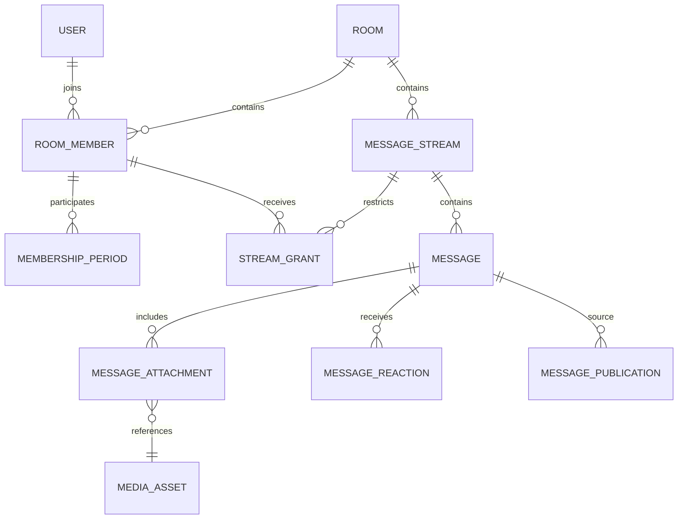

# 백엔드 제품·데이터·권한 설계

2026-09-20. 상태: 사용자 확정 요구를 반영한 구현 전 설계 초안.
테이블·API·구현 방식 중 **제안**은 아직 구현되거나 최종 승인된 계약이 아니다.
이 문서는 기반 설계의 단일 스트리머 전제와 잠정 메시지 공개 규칙을 구체화한다.
인프라 구축은 별도 작업이며 이 문서의 존재가 배포·보안 검증 완료를 뜻하지 않는다.

## 1. 확정 요구

- 첫 서비스는 후로기와 팬을 위한 방 하나. 처음부터 다중 사용자·다중 방·다중 스트리머를 지원하는 모델을 사용한다.
- 일반 단체방도 표현할 수 있는 채팅 코어 위에 버블형 방의 발송·열람 정책을 둔다.
- 스트리머 전체 메시지, 팬의 비공개 메시지, 스트리머의 개별 답장, 메시지별 emoji 반응을 지원한다.
- 스트리머는 자기 방의 모든 비공개 메시지를 별도 동의 없이 방 전체에 공개할 수 있다.
  팬 승인·공개 허용 플래그를 요구하지 않는다. 다른 방에 대한 권한은 생기지 않는다.
- 일반 어드민은 비공개 대화 열람 권한이 없다. 별도 범위·기간·사유가 있는 권한을 구분한다.
- 과거 기록 공개 여부는 방별 설정. 입장 당시 정책·조회 시작점은 유지하고 재입장은 새로 계산한다.
- 사용자 PK는 UUID. 닉네임·프로필 이미지·선택 생일을 설정할 수 있다.
- 생일은 월·일만 선택 입력, 기본 비공개. 본인이 스트리머에게 공개하도록 선택할 수 있다.
- 사진·동영상·이모티콘 등 다양한 메시지 콘텐츠를 지원한다.
- 팬과 스트리머 모두 미디어 전송을 허용하며 종류·용량·빈도는 방별로 제한한다.
- 작성자는 기간 제한 없이 자기 메시지를 모두에게 삭제할 수 있다.
- 사용자당 메시지별 emoji 반응은 1개이며 다른 emoji를 선택하면 교체한다.
- 미디어는 private R2에 저장. Backend가 매번 권한 확인 후 **60초 GET Signed URL**을 발급한다.
- 초기에는 운영자가 스트리머·방을 등록하고 로그인한 팬이 자유 입장한다.
  나중에 방별 초대·승인·비밀번호 입장을 지원할 수 있어야 한다.
- 원본 메시지를 모두에게 삭제하면 연결된 전체공개본·첨부 접근도 함께 회수한다.
  나에게만 숨기기는 별도 기능이다.
- 각 API·소켓 이벤트는 목적·역할·대상별 필드 검토 후 필요한 정보만 반환한다.

다중 방 지원은 초기 DB와 인가 테스트에 포함한다. 일반 사용자의 방 생성 UI,
스트리머 자동 입점, 결제·후원·통화까지 초기 출시 범위로 자동 확대하지 않는다.

## 2. 벤치마크와 확인 수준

2026-09-20 공식 소개·도움말을 확인했다. 로그인한 실제 앱의 전체 동작,
삭제 전파·동의 절차·운영자 권한·내부 DB 구조까지 검증한 것은 아니다.
제품 동작을 참고하며 타사 소스·브랜드·스티커·화면 자산은 복제하지 않는다.

| 출처 | 공식 자료로 확인한 동작 | 로기챗 반영 |
|---|---|---|
| [bubble 소개](https://www.dear-u.co/pages/business_bubble.php) | 아티스트와 팬의 개인 대화처럼 느껴지는 메시지·콘텐츠 경험 | 팬 화면은 공통 메시지와 자기 대화를 하나의 타임라인으로 제공 |
| [bubble 공식 앱 소개](https://apps.apple.com/eg/app/the-bubble-by-dear-u-intl/id6618122661) | 아티스트 메시지, 팬 답장, 기념일, 사진·동영상 사용 안내 | 미디어와 답장 경험 참고. 양방향 세부 권한은 별도 설계 |
| [bubble 답장 FAQ](https://ba-home.dear-u.co/ko/faq/21161252) | 구독 기념일에 따른 답장 글자 수 제한 | 상품 정책으로 분리 가능하나 초기 제한을 그대로 채택하지 않음 |
| [팬심M 개별 답장](https://blog.fancimm.com/fancare-fancim-reply) | 길게 누르기/스와이프로 해당 팬에게만 답장 | 일반 인용 답장과 개별 수신자 지정을 구분 |
| [팬심M 전체공개](https://blog.fancimm.com/fancim-function-public) | 팬 메시지를 길게 눌러 전체공개, 작성자 닉네임 비공개 | 별도 공개본 생성, 작성자 식별 정보를 반환하지 않는 안 |
| [팬심M 숨기기](https://blog.fancimm.com/fancare-fancim-hiding) | 특정 팬의 텍스트·사진·동영상·음성 등을 스트리머 화면에서 숨김 | 숨기기·알림 끄기·발송 제한·강퇴를 서로 구분 |
| [Telegram 답장](https://telegram.org/blog/reply-revolution) | 인용과 원문 이동, 원문 접근 권한 확인 | 인용·원문 이동도 원문 열람 권한 검사 |
| [Telegram 반응](https://core.telegram.org/api/reactions) | emoji 반응·집계·내 반응·방별 반응 설정 | 반응을 독립 모델로 두고 반응자 목록 공개 정책 분리 |

카카오톡·Messenger는 사용자 지정 UX 참고 대상이다. 모든 세부 기능을 실측했다고 주장하지 않는다.
초기 UX 계약 제안은 보내는 중/저장 완료/실패·재시도, 읽음, 인용 답장, emoji 반응,
사진 묶음·영상 썸네일, 미읽음 위치, 재접속·기기 간 동기화다.
DB 저장 ACK만으로 상대방 전달·읽음을 표시하지 않는다.
고정 메시지·검색·음성 메시지·편집·전달은 확장 항목이며 출시 순서는 별도 결정한다.

## 3. 앱 구조와 일반 채팅 코어

기반 DB는 다른 대화에서 갱신된 MySQL 호환 DB 결정에 맞춘다. Aurora MySQL의
배치·버전·적용 상태는 인프라 작업에서 확정한다. 이전 PostgreSQL 전제를 유지하지 않는다.
제안: NestJS 모듈형 단일 앱, MySQL 호환 DB, 동일 코드베이스의 별도 worker 실행.
API와 worker는 같은 QA 호스트에 둘 수 있지만 작업 수명은 HTTP 요청과 분리한다.
영상 처리 프로세스는 동시성·메모리·시간·네트워크를 제한하고 API를 막지 않게 한다.
Redis는 presence/rate limit/다중 API 전달에 필요한지 검증 후 도입한다.
메시지·수신 권한·재시도 상태의 영속 원본은 관계형 DB다.

`room.mode = FAN | GROUP`는 검토된 정책 preset이다. 저장 구조를 완전히 나누거나
임의 실행 가능한 정책 언어를 만들지 않는다. 모드 변경으로 기존 restricted stream의
권한을 전체 공개로 바꾸지 않는다. 변경은 향후 발송의 기본값에만 적용한다.
과거 메시지 공개는 명시적인 publication 명령으로 처리한다.

스트리머 자격과 방 역할은 분리한다. 한 사용자는 A 방의 스트리머이면서 B 방의 팬일 수 있다.
후로기 ID·방 ID를 코드 상수나 SOOP 닉네임 비교로 인가하지 않는다. 첫 방은 검증된 계정에
대한 운영 등록으로 만들며 최초 가입자에게 자동 owner를 주지 않는다.

### 주요 모델 제안

| 모델 | 핵심 필드·제약 |
|---|---|
| `users` | UUIDv4 PK 제안, 계정 상태, 생성 시각. SOOP subject와 분리 |
| `user_profiles` | user FK, 닉네임, 프로필 asset FK. 생일 월·일과 노출 설정은 비공개 필드 |
| `platform_soop` / `auth_sessions` | [인증 설계](soop-authentication.md). 고유 subject, 세션 digest·만료·폐기 |
| `creator_accounts` | 스트리머 등록·상태. 방 역할을 자동 승격하지 않음 |
| `rooms` / `room_policy_versions` | UUID, 모드·이름·상태, 입장·과거 기록·콘텐츠·반응 정책 버전 |
| `room_members` | UUID, room/user FK, 방 역할·상태·알림 설정. `(room_id,user_id)` unique |
| `membership_periods` | UUID, member FK, 가입/종료 시각, 입장 정책 버전, `visible_from_order`. 활성 기간 최대 1개 |
| `message_streams` | UUID, room FK, `ROOM_SHARED | RESTRICTED`. 팬별 비공개 대화도 공통 구조로 표현 |
| `stream_grants` | restricted stream과 해당 방 member의 명시적 열람/발송 권한, 기간·철회 상태 |
| `messages` / `message_revisions` | UUID, room/stream/sender FK, 내부 순서, typed content, 인용 대상, version, 삭제 상태 |
| `message_publications` | 비공개 원본과 새 shared 메시지의 내부 연결, 공개한 스트리머·시각·원본 revision |
| `message_reactions` | message/member/reaction key. 중복 방지, 삭제 가능한 별도 리소스 |
| `media_assets` / `media_variants` | UUID, 업로더·업로드 문맥·상태, private object key, 검증 결과·크기·유형·변형 |
| `message_attachments` | message/asset 연결과 순서. 파일 접근은 이 연결을 통해 검사 |
| `room_events` / `outbox_events` | 트랜잭션 내 변경, 이벤트 UUID·version, 재시도·lease·실패 상태 |
| `member_read_states` / `push_subscriptions` | 회원별 읽음·기기별 구독. 다른 팬의 상태를 기본 노출하지 않음 |
| `moderation_actions` / `audit_events` | 차단·강퇴·권한 변경·예외 열람의 행위자·범위·사유, 본문 제외 |

사용자와 외부에서 참조하는 리소스 ID는 UUIDv4를 제안한다. UUID는 인가를 대체하지 않는다.
내부 ordering counter는 정수여도 되지만 PK·사용자 수·다른 팬 활동 추정값으로 노출하지 않는다.
room/stream/member/message 연결은 복합 FK 등 DB 제약으로 다른 방 연결을 막는다.
membership·stream·메시지 순서·반응 unique 인덱스와 MySQL 동시성 테스트를 함께 정의한다.
UUID 저장은 `BINARY(16)`과 ORM에서 지원하는 고정 문자열 표현을 비교해 결정하며,
API는 표준 UUID 문자열을 사용한다. 자동 증가 user PK는 사용하지 않는다.
PostgreSQL 전용 partial index를 가정하지 않는다. 활성 참여 기간 1개 제약은
잠근 member 행의 active period FK와 유일성 제약 등 MySQL에서 검증 가능한 방식으로 구현한다.
문자열 collation·UTC 시각·JSON·row lock/deadlock retry를 실제 채택 버전에서 시험한다.

## 4. 발송·열람·전체공개

| 종류 | 발송자 | 열람 대상 |
|---|---|---|
| FAN 전체 메시지 | 해당 방 스트리머 | 과거 기록 기준을 충족하는 활성 참여자 |
| FAN 팬 메시지 | 팬 | 작성자와 지정 스트리머 |
| FAN 개별 답장 | 스트리머 | 지정 팬과 해당 대화의 스트리머 |
| FAN 전체공개본 | 스트리머의 공개 명령 | 해당 방 공통 메시지 열람자 |
| GROUP 일반 메시지 | 발송 권한 있는 참여자 | 방 정책·과거 기록 기준을 충족하는 참여자 |

인용·반응·첨부에도 같은 열람 규칙을 적용한다. private 메시지의 내용·존재·건수를 다른 팬에게 노출하지 않는다.
`canReadMessage(actor,message,context)`는 활성 계정, 현재 방 참여 기간, 방 접근/정지 정책,
삭제 여부, 입장 기준, shared stream 또는 명시적 restricted grant를 모두 확인한다.
목록은 인가 조건을 DB 질의에 적용하고 상세·소켓·검색·미디어도 동일 규칙을 사용한다.
화면에서 숨기거나 소켓 room 이름을 아는 것만으로 권한을 부여하지 않는다.

caller는 세션으로 결정한다. `senderId`, 임의 `userId`, `role`, `isPublic`, object key를
받아 내부 엔티티를 그대로 갱신하는 범용 PATCH는 제공하지 않는다.
개별 답장에는 대상 방 member와 인용 메시지를 검증한다. 팬은 다른 팬에게 private 대화를
생성하거나 방 전체로 발송할 수 없다. restricted 수신자는 명시적으로 고정한다.
새 스트리머/매니저 추가·방장 변경이 과거 대화 자동 열람을 뜻하지 않는다.
공동 운영은 과거 접근 범위를 포함한 별도 권한 변경이며, 어드민도 일반 조회를 우회하지 않는다.

### 전체공개와 삭제 연쇄

확정: 스트리머는 자기 방의 모든 비공개 메시지를 팬 동의 없이 공개할 수 있다.
삭제·서비스 제재된 메시지 복구나 다른 방 메시지 공개까지 허용하는 의미는 아니다.
전체공개는 인터넷 공개가 아닌 해당 방 열람권자 대상이다.

제안: 원본 ACL을 바꾸지 않고 새 shared 메시지를 만든다. 공개 스냅샷·내부 연결·감사·outbox를
같은 transaction에 기록한다. 공개 시각에 새 순서를 부여하므로 입장 이후 공개된 메시지는
원본이 오래됐어도 볼 수 있다. 같은 원본 revision의 중복 공개는 멱등 처리한다.
공개 DTO는 원본 ID·stream ID·작성자 UUID·닉네임·프로필·SOOP 정보·원본 반응을 포함하지 않는다.
원문 이동과 비공개 인용의 재귀 복사는 금지한다. 공개본의 반응·attachment ID도 분리한다.

공개본 미디어는 검증된 버전에서 별도 private key를 생성하고 원본 파일명·EXIF 등
메타데이터를 제거한다. 텍스트·사진 자체에 이름/얼굴이 있으면 작성자 필드를 숨겨도
신원을 알 수 있으므로 콘텐츠의 완전 익명성을 보장하지 않는다.
원본 편집을 공개본에 자동 반영하지 않는다. 개별 공개 명령 없이 stream 전체를 공개하지 않는다.
미디어 복사/검증은 DB transaction 밖의 영속 작업으로 준비한다. publication은
`PREPARING → PUBLISHED → REVOKED` 상태를 가지며 준비 중에는 다른 팬에게 노출하지 않는다.
최종 publish transaction에서 원본 revision·삭제 상태·스트리머 권한·준비된 첨부를 다시 검사하고
공개 메시지·순서·outbox를 함께 확정한다. 도중 원본이 삭제되면 준비를 취소하고 고아 파일을 정리한다.

원본의 모두에게 삭제는 연결된 공개본을 함께 tombstone 처리하고 첨부 신규 발급을 즉시 막는다.
작성자 삭제에는 전송 이후 시간 제한을 두지 않는다. 조회 시작점 밖의 자기 메시지 삭제도
새 본문 열람권을 부여하지 않는 소유권 기반 명령으로 설계한다. 비활성 계정의 삭제 요청은
계정 생명주기·탈퇴 절차에서 처리하며 일반 채팅 접근권을 복구하지 않는다.
공개/삭제가 경쟁하면 동일 원본 잠금·version 검사로 삭제 후 공개본이 살아남지 않게 한다.
공개본 삭제/철회 이벤트는 이전 열람자에게 전달한다. R2 실제 삭제는 영속 작업으로 재시도하며
참조 수·용도를 확인해 다른 정당한 파일을 지우지 않는다. 원본을 나에게만 숨기는 것은 전파하지 않는다.
이미 발급된 60초 URL·다운로드·스크린샷까지 회수할 수 있다는 의미는 아니다.

### 입장 당시 과거 기록 정책

방 정책은 `ALL_AVAILABLE | SINCE_JOIN`을 제안한다. 입장 transaction에서 정책 버전과
조회 시작점을 기록하고 이후 설정 변경은 기존 참여 기간에 소급하지 않는다.
퇴장 후 재입장은 새 기간을 만들고 당시 설정으로 다시 계산한다.
가입과 메시지 저장은 같은 방의 순서 규칙으로 직렬화해 경계 race를 없앤다.
과거 기록 허용은 shared 메시지와 본래 권한 있는 private 메시지에만 적용한다.
다른 팬 대화는 공개하지 않는다. 재입장 시 이전 읽음/cursor를 새 기간에 그대로 재사용하지 않는다.
강퇴·차단·탈퇴·삭제는 과거 열람권보다 우선한다. 예전 grant가 남아 있으면 새 조회 기준과
교차해 열람하며 철회된 grant를 재입장으로 복원하지 않는다.

### 입장 방식의 확장

초기 `OPEN_AUTHENTICATED`, 향후 `INVITE_ONLY | APPROVAL | PASSWORD` 정책을 제안한다.
가입 자격과 가입 후 메시지 열람권은 별개다. 비밀번호를 맞혔다고 비공개 대화를 읽을 수 없다.
초대는 난수 token digest·만료·사용 횟수·대상 방·철회 상태, 승인은 신청과 승인자를 기록한다.
비밀번호는 URL/로그/응답에 넣지 않고 검증된 password hashing으로 저장하며 시도 제한을 둔다.
방 비밀번호 변경의 기존 멤버 퇴장 여부는 향후 별도 결정한다. 현재 정책 snapshot으로 과거 기록은 보존한다.

## 5. API 최소 응답과 프로필

보안 스킬의 응답 allowlist 원칙과 [OWASP 객체 속성 인가](https://github.com/OWASP/API-Security/blob/master/editions/2023/en/0xa3-broken-object-property-level-authorization.md)를 적용한다.
ORM 직렬화나 하나의 공용 `UserDto`로 모든 필드를 보내지 않는다. DTO별로 사용 화면·열람자·
필드별 이유·금지 필드·캐시 정책·부정 테스트를 기록한다. 입력과 출력 schema는 별개로 검사한다.

| 응답 문맥 | 기본 허용 필드 제안 | 기본 제외 |
|---|---|---|
| 내 계정 `/me` | 내 UUID, 닉네임, avatar 참조, 내가 설정한 생일·설정, 필요한 계정 상태 | SOOP 원본/subject, token, 세션 digest, 운영 메모 |
| 방 목록 | room UUID, 이름·이미지, 내 역할·capabilities, 보이는 마지막 메시지·미읽음 | 다른 팬의 최신 메시지, private 전체 건수, 전체 참여자 목록 |
| 방 안 표시 프로필 | 방 범위 actor UUID, 닉네임, avatar 참조, 필요한 배지 | 전역 user PK, 기본 생일, 다른 방 가입 이력, 연락처, SOOP ID |
| 일반 메시지 | UUID, 허용된 작성자 표시, typed content, 시각·version, 허용된 인용·첨부·반응 | 내부 순서/ACL/grant, 별도 object key 필드, 타인 clientMessageId |
| 익명 공개본 | 새 UUID, `author.kind=anonymous`, 본문·새 첨부, 공개 시각 | 원본 작성자·원본 ID·원본 시각·원본 대화 참조 |
| 반응 | emoji별 count, 내 반응 | FAN 방 다른 팬의 반응자 ID·닉네임 목록 |
| 다운로드 발급 | 선택 variant URL, `expiresAt`, 검증된 content type | 다른 variant URL, bucket 목록, 사용자 정보 |
| 운영 화면 | 해당 업무에 필요한 최소 상태·제재·감사 정보 | 어드민이라는 이유만으로 대화·생일 전체 노출 |

닉네임은 정규화·길이·제어문자를 검증하고 인증 식별자로 사용하지 않는다. 배지는 서버가 부여한다.
프로필 이미지도 private R2 검증 variant를 사용하고 허용된 표시 문맥으로 URL을 발급한다.
FAN 방은 다른 팬의 프로필 디렉터리를 기본 제공하지 않는다.
생일은 월·일만 저장하고 연도/나이를 추론하거나 age verification으로 사용하지 않는다.
제안: 스트리머 공개 선택은 방별 member 설정으로 두어 새로 들어간 방에는 자동 공개하지 않는다.
공개를 끄면 이후 스트리머 프로필 조회에서 생일을 제외하고 캐시를 무효화한다.
팬·일반 어드민·다른 방 스트리머에게는 반환하지 않는다. 생일 미입력으로 채팅을 제한하지 않는다.

## 6. 콘텐츠·반응·사용감

콘텐츠는 version이 있는 typed union으로 제한한다: `TEXT`, `MEDIA`, `STICKER`, `SYSTEM`을
첫 대상으로 제안하고 `AUDIO` 등은 추가 variant로 확장한다. MEDIA는 순서가 있는 attachment와
선택 caption을 갖는다. 임의 HTML·실행 코드·무제한 JSON을 받지 않는다.
이모티콘은 승인된 pack/item/revision으로 참조하고 임의 외부 이미지 URL을 실행하지 않는다.
스티커와 emoji 반응은 별도 모델이다. 팬과 스트리머 모두 미디어를 전송할 수 있으며
허용 종류·용량·빈도는 방별 정책으로 제한한다.

반응은 메시지 열람·반응 권한이 있을 때만 생성/삭제한다. `PUT`/`DELETE`로 멱등 처리하고
기기 간 동기화한다. 확정 정책은 메시지당 사용자 1개 반응, 변경 시 교체다.
`(message_id, member_id)` unique와 원자적 upsert를 사용한다. FAN shared 메시지는 집계와
내 반응만, private 메시지는 해당 대화 참여자에게만 표시한다. 공개본으로 원본 반응을 옮기지 않는다.
GROUP 반응자 목록 공개는 별도 정책으로 둔다.

인용 대상이 열람 불가이면 본문/작성자/첨부를 반환하지 않는다. 전체 발송에 private 인용을
붙여 공개 범위를 넓히지 못한다. 필요한 공개는 스트리머 publication 명령을 사용한다.
나에게만 숨기기, 모두에게 삭제, 특정 팬 숨기기, 접근 차단은 서로 다른 상태로 모델링한다.

## 7. 영속화·소켓·읽음·재접속

발송은 계정·방 참여·대상·콘텐츠 검사 → transaction → ACK 순서다.
멱등 키, 메시지·첨부, 방 이벤트, outbox를 하나의 transaction에 저장한다.
멱등 키는 `(room_id,sender_id,client_message_id)`이고 payload hash가 다르면 충돌 처리한다.
retry 허용 기간과 키 보존 기간을 맞추며 삭제 후 retry로 메시지가 되살아나지 않게 한다.

내부 순서는 방 counter를 같은 transaction에서 잠그고 증가시키는 안이다. 커밋 순서가 뒤집혀
cursor 앞의 이벤트를 나중에 놓치지 않게 한다. hot room 잠금 비용을 부하 시험한다.
외부 cursor는 사용자·방·참여 기간·query·정책 epoch에 결합한 암호화 인증 토큰 또는 서버 저장 난수 참조다.
단순 base64 sequence는 허용하지 않는다. 권한 없는 메시지의 순서 간격을 노출하지 않는다.

outbox는 at-least-once이며 lease·재시도·실패 작업 격리·관측을 둔다. 클라이언트는 이벤트 UUID와
message version으로 중복·역순 갱신을 처리한다. 소켓 연결 복구에만 의존하지 않고 DB catch-up을 제공한다.
목록/이벤트는 인가 필터 후 페이지를 만들고 타인의 건수를 cursor·total로 보내지 않는다.
소켓 연결과 각 명령 모두 인가한다. 웹 Origin·세션을 검증하고 로그아웃·만료·제재·강퇴 때 구독을 무효화한다.
fanout·replay·push 실행 직전 현재 권한을 검사하며 회수와 발송은 같은 멤버/방 직렬화 규칙으로 순서를 정한다.
이미 전달한 bytes의 회수를 보장하지 않는다. 공통 payload도 수신 자격 검사를 생략하지 않는다.

읽음은 실제 표시한 권한 있는 메시지를 기준으로 단조 증가한다. 미읽음은 보이는 incoming만
계산하며 hidden sequence 차감으로 구하지 않는다. 소켓 연결·푸시 성공은 읽음이 아니다.
팬별 읽음은 다른 팬에게 노출하지 않는다. 삭제/철회 tombstone은 이전 열람자에게만 최소 필드로 전달한다.
접근이 사라진 방은 최소 권한 회수 신호로 로컬 데이터를 정리하고 새 수신자에게 private ID를 보내지 않는다.
typing/presence를 추가할 때도 같은 audience를 적용한다. FAN 방 전체에 팬의 접속·입력 상태를 broadcast하지 않는다.
오프라인 기기에 대한 삭제 동기화는 다음 인증/접속 때 수행한다. 로그아웃·계정 전환 시 로컬
사용자별 캐시와 다운로드 참조를 정리하며 오프라인에 이미 저장된 콘텐츠의 원격 즉시 삭제는 보장하지 않는다.

## 8. R2 검증과 60초 조회

확정 경로: `클라이언트 → Backend 인가 → 60초 GET Signed URL → private R2`.
각 발급마다 세션·현재 방 참여·메시지/프로필 열람·attachment 연결·삭제·검증 상태를 확인한다.
bytes는 R2에서 직접 받는다. 프로필·원본·썸네일·영상 poster도 동일 원칙이다.
public bucket/r2.dev/public custom domain을 사용하지 않는다. QA/prod bucket·credential을 분리한다.
관리 권한과 runtime object 권한은 분리하고 실제 제공되는 bucket/operation 권한으로 최소화한다.

Signed URL은 bearer capability다. 60초 동안 공유·재사용될 수 있으며 차단 후 신규 발급은
거부하지만 기존 URL·진행 중 전송·다운로드한 파일은 즉시 회수되지 않는다. 사용자 선택으로 수용한 경계다.
[Cloudflare 공식 계약](https://developers.cloudflare.com/r2/api/s3/presigned-urls/).
URL에 S3 endpoint·object 식별 정보가 포함되므로 숨겨진다고 주장하지 않는다. 무작위 object key에
사용자명·생일·방 이름을 넣지 않는다. 서명 URL query와 메시지 본문은 로그/APM에 기록하지 않는다.
발급 응답과 private object는 `Cache-Control: private, no-store`를 기본 적용한다.
API·SW·공유 CDN 캐시로 우회 열람하지 않게 한다. CORS는 인증을 대체하지 않는다.

업로드 파이프라인 제안:

1. Backend가 업로더·문맥·유형·quota를 검사하고 upload intent와 격리 key를 생성한다.
2. 해당 key에만 짧은 PUT URL을 발급한다. PUT TTL은 조회의 60초와 별개로 결정한다.
   큰 파일은 서버가 생성/완료하는 multipart와 제한된 part 발급을 사용한다.
3. 완료 신고를 신뢰하지 않고 크기·magic bytes·디코딩·해상도·길이·checksum을 검사한다.
   이미지 EXIF/GPS 제거·재인코딩, 영상 변환·poster 생성, 악성 파일 검사를 worker에서 수행한다.
4. 검사한 bytes를 서버만 쓸 수 있는 새 final key로 확정한다. 미만료 PUT로 격리 파일을
   다시 써도 검증된 파일을 바꾸지 못한다. 검사와 copy 사이의 변경도 고정된 검증 입력 또는
   checksum/조건부 읽기로 차단한다. R2 ETag를 항상 MD5라고 가정하지 않는다.
5. `READY` asset만 본인 intent의 허용 문맥에 연결한다. 다른 방 asset 재사용은 거부한다.
   완료·첨부 시 현재 권한을 재검사하고 DB/R2 간 실패는 영속 작업·보상·재시도로 처리한다.
6. 거절·미완료·미첨부 파일과 multipart는 lifecycle/정리 작업으로 만료시킨다.

Content-Type 서명만으로 내용 검증을 대신하지 않는다. 직접 PUT는 저장 전 모든 크기·내용 검사를
보장하지 않으므로 발급 빈도·intent quota·후속 거절·고아 파일 정리를 둔다. 하드 ingress
상한이 필요하면 업로드 gateway를 추가한다. SVG/HTML/실행 파일과 외부 URL import는 초기 미지원이다.
decoder는 비신뢰 입력을 처리하므로 프로세스 격리·패치·자원 제한이 필요하다.
영상 seek/Range에서 만료되면 Backend 재인가·재발급 후 재생 위치를 유지한다.
일괄 발급도 최대 개수와 asset별 인가를 적용하고 권한 없는 항목의 존재를 노출하지 않는다.
다운로드 API는 임의 bucket/key가 아닌 message/attachment/variant 문맥을 받는다.
내 프로필 preview 등 별도 경로도 메시지 인가의 우회 통로가 되지 않게 정의한다.

## 9. 초기 HTTP·이벤트 계약 제안

현재 endpoint는 존재하지 않는다. 최종 URI/DTO는 OpenAPI·소켓 schema로 고정한다.

| 경로 | 책임 |
|---|---|
| `GET/PATCH /v1/me` | 내 프로필 조회·허용 필드 변경 |
| `GET /v1/rooms` | 내가 볼 수 있는 방·마지막 메시지·미읽음 |
| `POST /v1/rooms/:roomId/join`, `POST .../leave` | 입장 정책 snapshot, 참여 종료 |
| `GET/POST /v1/rooms/:roomId/messages` | 인가된 타임라인/발송, target intent·멱등 키 |
| `POST /v1/rooms/:roomId/messages/:messageId/publications` | 스트리머의 익명 전체공개본 생성 |
| `DELETE /v1/rooms/:roomId/messages/:messageId` | 권한 있는 모두에게 삭제·연결 공개본 회수 |
| `PUT/DELETE /v1/rooms/:roomId/messages/:messageId/reactions/me` | 내 반응 설정/취소 |
| `PUT /v1/rooms/:roomId/read-state` | 내 읽음 위치 갱신 |
| `GET /v1/rooms/:roomId/events` | 현재 권한을 적용한 catch-up |
| `POST /v1/media/upload-intents`, `POST .../:id/complete` | 업로드 권한·처리 상태 |
| `POST /v1/rooms/:roomId/messages/:messageId/attachments/:attachmentId/access` | variant 60초 URL 발급 |
| `POST /v1/rooms/:roomId/actors/:actorId/avatar/access` | 열람 가능한 프로필 60초 URL 발급 |
| `POST/DELETE /v1/push/subscriptions` | 내 기기 구독 등록·해제 |

소켓 이벤트는 `message.created/updated/deleted`, `reaction.updated`, `publication.revoked`,
`read.updated`, `membership.revoked`를 제안한다. schema version·이벤트 UUID·리소스 version을
두고 HTTP와 같은 DTO projection을 사용한다. 민감 리소스 미존재/접근 불가는 일관된 404,
인증 실패는 401로 구분하며 validation error로 숨겨진 리소스 존재를 드러내지 않는다.

## 10. 보안·검증·구현 순서

웹 인증은 [SOOP 세션 계약](soop-authentication.md)의 host-only HttpOnly cookie,
CSRF·정확한 Origin/CORS를 유지한다. 메시지·파일·방 설정·권한 변경에 rate/size/batch 제한을 둔다.
API DNS-only 환경에 proxy WAF가 있다고 가정하지 않는다. DB 파라미터 바인딩,
outbound SSRF 방어, 명시적 proxy trust, 안전한 오류·로그 정책을 적용한다.

서버가 내용을 처리하는 구조이며 E2EE를 구현했다고 주장하지 않는다. TLS,
DB·R2·백업 저장 암호화, 운영자 접근 분리·감사를 별도로 검증한다. 기본 어드민 열람 제한은
DB/호스트 운영자가 기술적으로 절대 읽을 수 없다는 뜻이 아니다. application-level envelope
암호화와 별도 key custody는 위협 모델·검색·복구 요구에 맞춰 후속 ADR로 확정한다.

push 직전 계정·방·메시지 권한·알림 설정을 검사한다. 기본 push에는 본문·팬 신원·Signed URL을
넣지 않고 앱에서 인증 후 조회한다. 구독 endpoint SSRF 방어, 404/410 정리,
로그아웃/계정 전환 연결 해제를 [웹 푸시 요구](web-push-foundation.md)와 함께 구현한다.

구현 통과 기준:

- 팬 2명·스트리머 2명·어드민·비회원·탈퇴자와 최소 2개 방을 사용하는 인가 matrix.
- 남의 UUID, room/stream/attachment 조합, 생일·프로필·반응·인용·검색·미읽음 부정 테스트.
- FAN/GROUP 변경 후 과거 private 유지, 입장 경계 race·재입장·정책 snapshot.
- 어드민 비공개 열람 거부, 방 범위·예외 권한 기간·감사 기록.
- 별도 동의 없는 전체공개, 익명 DTO·첨부·원본 참조 차단, 공개와 원본 삭제의 동시 실행.
- 멱등 retry·동시 전송·DB 커밋 후 종료·outbox 재발행·catch-up·읽음 역행 방지.
- 삭제/강퇴/탈퇴와 socket·replay·push·URL 발급 경쟁 시 신규 노출 차단.
- R2 public 접근 거부, 정상/만료/변조 URL, 다른 방/검사 전 asset·재업로드 변조 거부.
- 실제 QA R2의 CORS·60초 만료·영상 Range·재발급. mock만으로 완료 판정하지 않음.
- TS/Kotlin/Swift 동일 fixture, 출력 추가 필드·payload/log/notification 유출 검사.
- 자원 제한·hot room 부하·외부 백업 restore·삭제 데이터 재노출 방지.

미확정 상세: 생일 공개의 방별 설정 제안, 메시지 편집·읽음 표시,
구체적인 파일 크기/길이/빈도 한도, 스티커 등록 주체, 보존·탈퇴·백업 삭제,
운영자 예외 열람 절차, 첫 출시의 음성/검색/고정 메시지 범위, 예상 동접·미디어 사용량.
자동 영구 보존이나 bubble식 구독 글자 수 제한은 확정하지 않는다.
실제 사용자 데이터를 받기 전에 보존·탈퇴·복구 정책을 고정한다.

구현 순서 제안: (1) 계정·다중 방·인가·DTO, (2) 텍스트·개별 답장·공개본·동기화,
(3) R2 검증·사진/영상/스티커, (4) 반응·읽음·푸시, (5) 운영·보존/복구·부하 검증.
각 단계의 인가 검증을 완료하며 쌓는다. 앱 코드·DB migration·cloud 자원 생성은 이 변경에 포함하지 않는다.

보안 참고: [객체 인가 시험](https://wstg.owasp.org/latest/4-Web_Application_Security_Testing/12-API_Testing/02-API_Broken_Object_Level_Authorization/),
[WebSocket 보안](https://cheatsheetseries.owasp.org/cheatsheets/WebSocket_Security_Cheat_Sheet.html),
[파일 업로드](https://cheatsheetseries.owasp.org/cheatsheets/File_Upload_Cheat_Sheet.html),
[R2 CORS](https://developers.cloudflare.com/r2/buckets/cors/).
