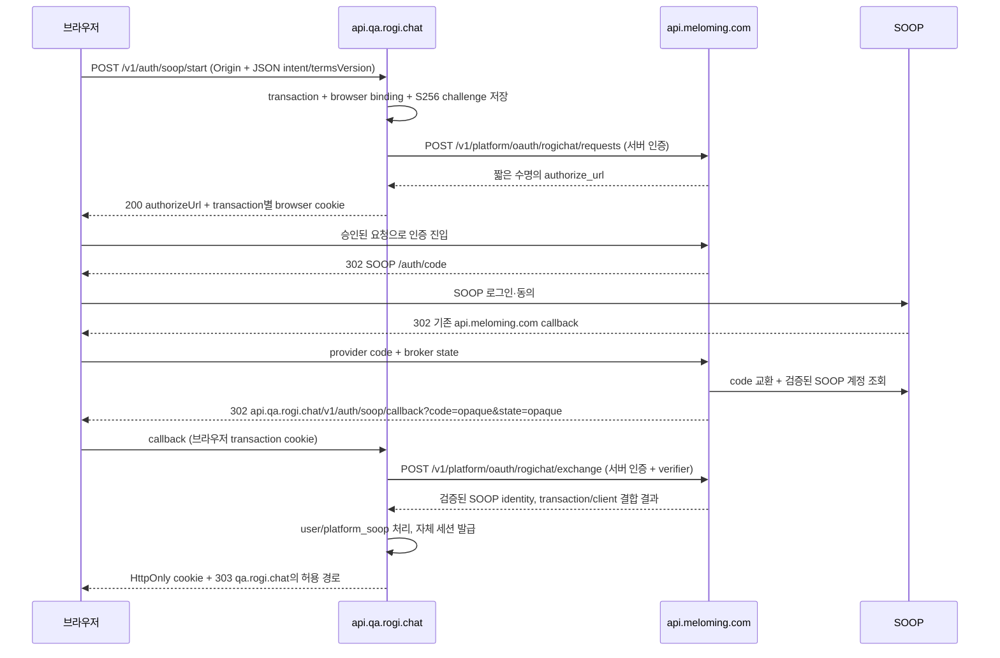

# 로기챗 SOOP 소셜로그인

2026-09-20 추가 결정: Apple 로그인을 지원하며 Apple 가입자도 SOOP 연결 후 채팅을 이용한다.
기존 SOOP 직접 로그인/연결 중계는 유지한다. 계정 상태·미연결 인가·충돌 처리·심사 검토는
[Apple 로그인과 SOOP 필수 연결](mobile-authentication.md)을 함께 따른다.

상태(2026-09-20 갱신): 로기챗 웹 endpoint·DB transaction·세션 구현과 QA foundation
가동은 완료했다. 외부 broker 소스에는 authorization code로 교환한 token을
`/validate/live/status`에 검증하고 응답의 정확한 `data.user_id`를 subject로 쓰는
구현과 회귀 테스트가 준비됐다. 이는 구현 상태이며 현재 배포·등록이나 실제 시청자
로그인 성공을 뜻하지 않는다. 배포는 별도 CI/운영 검증 대상이고, 설정 누락·공급자 장애·
지원하지 않는 응답은 오류로 처리한다. 과거 QA의 `503 AUTH_UNAVAILABLE` 관측을
모든 이후 배포의 고정 동작으로 간주하지 않는다. 아래 외부 중계·모바일
계약에는 아직 실환경 검증이 필요한 부분이 있다. 네이티브 상세 구현 순서는
[native 인증 계약](backend-native-auth-contract.md)을 따른다.
QA 웹 `https://qa.rogi.chat`, QA API `https://api.qa.rogi.chat`.
운영 웹 `https://rogi.chat`, 운영 API `https://api.rogi.chat`은 대응되는 제안이다.

## 확인한 기존 동작

2026-09-19 기존 인증 서버 저장소의 origin/main `a56bd52f`를 기준으로 조사했다.
소스의 URI versioning과 controller 조합은 다음 공개 경로를 만든다.

| 단계 | 확인한 경로/동작 |
|---|---|
| SOOP 시작 | `GET https://api.meloming.com/v1/platform/oauth/soop` |
| 공급자 인증 | `https://openapi.sooplive.co.kr/auth/code`로 redirect |
| 공급자 callback | `https://api.meloming.com/v1/platform/oauth/soop/callback` |
| 서버 간 token 교환 | SOOP `/auth/token`, 기존 서버의 client credential 사용 |
| 사용자 정보 | SOOP `/user/stationinfo` 호출 |
| 기존 외부 서비스 중계 | 허용된 반환 경로에 짧은 수명의 일회용 code 전달, 서버 인증 후 profile 교환 |

진입점에 redirect를 따라가지 않는 GET을 한 번 보내 HTTP 302와 SOOP 목적지,
등록 callback을 확인했다. client ID/state/토큰을 공개 기록에 저장하지 않았다.
실제 사용자 동의, token 교환, 배포된 코드 SHA, 최종 로그인 성공은 검증하지 않았다.

소스 근거: `src/main.ts:505`, `src/platform/platform-oauth.controller.ts:168`,
`src/platform/platform-oauth.service.ts:145`, `src/platform/soop-platform.service.ts:14`.
기존 bridge의 서버 인증·일회용 code 소비 패턴은 재사용 후보이며, 로기챗의
client 등록과 transaction 결합은 별도로 추가한다. 현재 `from` 문자열을 전달하는
것만으로 로기챗 로그인이 완성되는 것은 아니다.

기존 플랫폼 연결 경로도 확인했다. `POST /v1/platform/verification/verify/SOOP`는
`JwtAuthGuard`로 기존 서비스 로그인 사용자를 요구하고 OAuth token을 받아
`UserPlatformVerification`을 갱신한다. `(userId, platform)`과
`(platform, platformUserId)` unique 제약이 있는 **회원의 플랫폼 연결** 기능이다.
로기챗의 소셜 가입/로그인을 이 경로에 의존시키지 않고, identity 중계 후 로기챗의
user/platform_soop를 관리한다. 근거는 `platform-verification.controller.ts:45`,
`platform-verification.service.ts:54`, `prisma/schema.prisma:1170`이다.

## 도메인 모델

| 도메인/테이블 | 소유하는 데이터와 불변식 |
|---|---|
| `user` | 로기챗 내부 UUID, 표시 이름, 서비스 상태, 약관 동의, 자체 세션/권한 |
| `platform_soop` | UUID, `user_id` FK, SOOP의 검증된 canonical subject, handle·이미지 표시 정보, 연결/검증 시각 |
| `auth` | 로그인 transaction, broker client 검증, 세션 발급·폐기·만료 |

`platform_soop.provider_subject`에 unique 제약을 두어 같은 SOOP 계정이 두 유저에게
동시에 연결되지 않게 한다. 초기에는 `user_id`도 unique로 두어 한 사용자에 SOOP
계정 하나를 허용하는 안을 제안한다. 다중 연결이 필요하면 명시적으로 변경한다.
SOOP nickname·이미지 URL·표시 handle을 신뢰 가능한 고유 subject 대신 쓰지 않는다.
현재 broker 구현은 token에 결합된 `/validate/live/status` 응답의 `data.user_id`만
사용하며 대소문자를 포함한 원문을 보존한다. station number·handle·nickname·이미지
경로로 대체하거나 별칭을 자동 병합하지 않는다. 로기챗 내부 PK는 계속 UUID이며
기존 transaction·browser·redirect·client·S256 결합과 계정 연결 충돌 방어를 유지한다.
이 모델은 공급자의 계정 ID 할당을 신뢰하며, 문서화되지 않은 평생 비재할당을
보장하지 않는다. 외부 ID 재할당은 조건부 공급자 신뢰 위험으로 남는다. 실제 일반
시청자·스트리머 로그인은 아직 실증 대상이며, 검증된 응답이 없으면 로그인에 실패한다.

`login`: 이미 연결됐으면 user 상태 검증 후 로그인, 없으면 로기챗 약관 동의를 거쳐
user와 platform_soop를 하나의 transaction에서 생성한다. 동시 가입은 unique 충돌을
재조회해 처리한다. 외부 서비스 회원 가입/계정 이관/회원 ID에 의존하지 않는다.
`link`: 로그인·최근 재인증·CSRF 검증이 된 user만 가능. transaction에 대상 user와
기존 session ID를 결합한다. 다른 user에 연결된 SOOP 계정은 자동 합치거나 옮기지 않는다.
로그아웃·user 변경·정지·탈퇴가 발생한 동안의 link callback은 거부한다.

## 제안하는 왕복 흐름

로기챗 웹 시작 API는 `POST /v1/auth/soop/start`와 JSON 응답의 `authorizeUrl`을
사용한다. 아래 외부 `/rogichat/*`는 전용 중계 계약이며 실제 운영 활성화는 별도
검증 대상이다. 준비된 소스 코드만으로 외부 서버 배포를 주장하지 않는다.

SOOP에 등록된 redirect URI와 client secret은 기존 서버에 그대로 둔다.
로기챗은 SOOP access/refresh token과 외부 서비스 JWT를 전달받지 않는다.
브라우저 URL에는 짧은 수명 일회용 bridge code만 전달한다. 클라이언트는 브라우저에서
중계 exchange를 호출하지 않으며, API 서버가 인증된 back-channel로 호출한다.
브라우저 navigation redirect는 CORS 대상 fetch가 아니므로 기존 서버의 CORS 목록을
로기챗 때문에 광범위하게 열 필요가 없다.

## 중계 요청 계약

- `requests`: 등록된 `client_id`, 고정 `redirect_uri`, `transaction_id`,
  `return_state`, `code_challenge`, `code_challenge_method=S256`를 서버 간 POST한다.
  반환 authorization URL은 scheme/host/path allowlist로 로기챗 서버에서도 검사한다.
- QA/prod client와 credential은 분리한다. 초기 QA callback은 정확히
  `https://api.qa.rogi.chat/v1/auth/soop/callback`만 허용한다.
- 시작 요청·provider state TTL은 10분 제안, bridge code TTL은 120초 제안이다.
  모두 고엔트로피 난수이며 원문 대신 digest로 저장한다. URL에 user ID/환경 설정을 싣지 않는다.
- broker는 state에 client/redirect URI/transaction/challenge/브라우저 결합 정보를
  서버 측으로 저장한다. 검증되지 않은 `from`, 임의 `redirect_uri`나 state 접미사로
  callback 목적지를 선택하지 않는다. provider state는 원자적으로 검증·소비한다.
- `exchange`: confidential client 인증 + code + 동일 redirect URI + transaction ID +
  verifier. client·환경·challenge가 모두 일치할 때만 code를 원자적으로 소비한다.
  최소 응답은 schema version, provider, canonical subject, 표시 정보, client ID,
  transaction ID, authenticated-at이다. 응답 전체와 수신 크기를 스키마로 검증한다.
- SOOP 자체 PKCE 지원은 미확인이다. 중계 구간 S256은 직접 구현할 수 있지만
  그것이 SOOP 구간 PKCE 지원을 의미하지 않는다. 공급자 지원 여부를 별도 확인한다.

state 브라우저 결합, exact redirect matching, code injection/replay 방어의 근거는
[OAuth Security BCP](https://www.rfc-editor.org/rfc/rfc9700.html)다. 위 계약은 로기챗의
설계이며 기존 중계가 이 조건을 모두 구현했다고 주장하지 않는다.

## 세션·브라우저·모바일

QA API는 `__Host-rogi_oauth`처럼 `Secure; HttpOnly; SameSite=Lax; Path=/`인
host-only transaction cookie를 사용한다. 서버 transaction은 이 브라우저에 결합하며
복수 탭도 transaction별로 구분한다. callback에서는 state·cookie·intent를 먼저
검증하고 일회성 processing 상태를 획득한 뒤 exchange한다. 중복 callback으로
user나 session을 중복 발급하지 않는다. 교환 결과를 확정하지 못한 timeout은
성공으로 간주하지 않고 새 로그인으로 재시도한다.

로그인 성공 후 API host-only HttpOnly session cookie를 새로 발급하고 고정 웹
origin의 검증된 상대 경로로 303 이동한다. frontend가 토큰을 localStorage에 저장하거나
callback query에서 계정 정보를 읽지 않는다. 웹→API는 `credentials: include`,
정확한 `https://qa.rogi.chat` CORS origin, credentials 허용, CSRF token/Origin 검증을
사용한다. QA/prod는 같은 site일 수 있으므로 SameSite만으로 격리하지 않는다.
`Domain=.rogi.chat` cookie를 금지하고 환경별 세션 저장소·서명키·audience를 분리한다.
SSR이 API host-only cookie를 받을 수 없으므로 초기 인증 데이터는 browser→API로
조회한다. BFF가 필요하면 별도 세션 전달 계약을 먼저 설계한다.

모바일도 system browser로 같은 broker 흐름을 시작한다. API callback 후 검증된
Universal/App Link에 별도의 일회용 app completion code를 넘기고, 앱이 보관한
S256 verifier로 교환한다. 앱 client와 web client를 구분하고 서버 전용 credential을
앱에 넣지 않는다. API callback URL을 App Link 대상으로 등록해 callback이 서버를
건너뛰지 않게 한다. API 세션은 Keychain/Android 보안 저장소로 관리한다.

## 실패와 운영 수명

거절·만료·provider 오류·프로필 조회 실패·중복 계정 연결은 정해진 오류 코드로만
반환한다. 검증된 transaction이면 로기챗 실패 화면으로 돌아가고, state가 유효하지
않으면 임의 주소로 redirect하지 않는다. 실패 시 SOOP/브리지 토큰이나 원본 예외를
query/log에 출력하지 않는다. callback과 exchange는 `Cache-Control: no-store`,
`Referrer-Policy: no-referrer`, 제3자 스크립트 제외, edge/origin/APM query redaction을 적용한다.

기존 서비스 종료 일정과 독립적으로 api.meloming.com OAuth 경로, SOOP 앱 등록,
DNS/TLS, code/state 저장소, client credential 운영을 유지해야 한다. 공유 서버의
회원가입 종료 설정을 풀지 않고 전용 bridge에서 로기챗 계정을 처리한다.
broker 장애 시 신규 로그인은 불가능하지만 기존 로기챗 세션은 자체 정책대로 유지한다.
운영 책임·지원 기간을 확정하지 않으면 이 의존성을 로그인 출시 조건으로 남긴다.

SOOP 동의 화면의 앱 이름은 기존 OAuth 앱 등록에 따라 기존 브랜드가 보일 수 있다.
등록 이름/로고 변경 또는 별도 앱 등록 없이는 코드만으로 이를 없앨 수 없다.
제품 자체에는 기존 브랜딩을 제거하되 외부 동의 화면까지 무브랜딩이 가능한지는
실제 등록 설정과 다른 소비자 영향을 검토한다.

## 구현·검증 게이트

1. 기존 서버의 로기챗 client/endpoint·state 분기·code exchange를 별도 변경으로 준비.
   기존 소비자의 callback 계약과 SOOP 등록 URI는 회귀 테스트로 보존한다.
2. 로기챗 user/platform_soop/auth 및 QA callback·세션을 구현한다.
3. TLS/CORS/cookie와 SOOP 일반 시청자·스트리머의 subject를 실증한다.
4. 성공/신규 가입/연결/동의 거절, state 변조·누락·재사용, code replay·동시 요청,
   QA code→prod exchange, verifier/credential 불일치, 브라우저 바꿔치기,
   다른 user 연결, provider timeout, broker 재시작을 검증한다.
5. 실제 QA 웹·Android·iOS 로그인과 기존 소비자 로그인이 성공한 후 출시한다.

최초 조사는 read-only였으며 이후 별도 승인으로 외부 broker 소스를 준비했다.
현재 token-bound subject 구현은 외부 broker의
`src/platform/rogichat-soop-identity.service.ts`와
`src/platform/rogichat-soop-provider.client.ts`에서 확인했다. 실제 외부 배포·등록,
일반 시청자·스트리머의 공급자 응답과 전체 로그인 성공은 아직 별도 증거가 필요하다. QA health 성공이나 합성 broker 시험으로 이를 대체하지 않는다.
