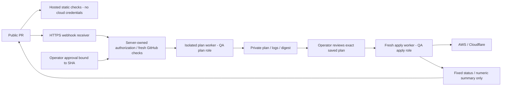

# 공개 저장소에서의 Atlantis 설계 비교

상태: private ops 분리 B안 승인. [별도 관리 EC2 사양·15개 자원 plan](management.md)을 사용자 승인 후 생성했다. GitHub App은 private ops에만 설치했다. [version-only 연결 단계](runtime/README.md)를 구현했으며 [격리 진단 worker](worker/README.md)는 실제 검사 12개와 종료·디스크 정리까지 검증했다. Terraform plan/apply worker는 아직 활성화하지 않았다.
**설계 판단:** 공개 저장소에서도 제한된 운영은 가능하지만, 표준 설정 몇 개만으로
자격증명 유출 방지를 보증할 수 없다. 아래 A안의 추가 실행 경계를 구축·시험할 수
있으면 선택 가능하다. 초기 로기챗에는 B안을 권고하며 공개 CI 자체는 유지할 수 있다.

## 선택지

| 안 | 공개 저장소 | 권한 있는 실행 | 장점 | 비용·잔여 위험 |
|---|---|---|---|---|
| A. 공개 PR + 격리 Atlantis | source/PR/검증 CI/결과 상태 | 외부 관리 영역의 승인된 plan/apply worker | 같은 PR에서 인프라 변경 검토 | 별도 authorization·sandbox·출력 통제 구현, 운영자/공급망 위험 잔존 |
| B. 공개 CI + 비공개 IaC/CD 실행 (권고) | source/테스트/빌드/GHCR | private control repo 또는 외부 실행기, 고정 SHA 승인 | GitHub에 SSH 키 불필요, public PR과 cloud 권한 분리 명확 | 승인 SHA·plan·release 연결을 관리해야 함 |
| C. CI/CD 전체 비공개 | source와 최소 무자격증명 검사만 | private CI/control | 공개 로그/artifact 범위를 가장 작게 만듦 | 빌드 접근권·비용·피드백 경로 증가, 악성 소스 실행 위험 자체는 남음 |

어느 안이든 IaC source of truth는 rogichat monorepo다. private 실행 저장소는
복제한 Terraform을 별도로 수정하지 않고 source SHA/root/environment/plan digest만
선택한다. 위치를 비공개로 옮겨도 무검토 PR head를 실행하면 안전하지 않다.

2026-09-19 추가 제안: `h66rogi/rogichat-ops`를 private 운영 저장소로 둔다.
[공개 범위·GitHub Free 제약·외부 승인 절차](../../docs/repository-isolation.md)를 따른다.
Free private에서 branch protection/environment approval을 사용할 수 있다고 가정하지
않으며, private PR merge만으로 Atlantis plan/apply를 허용하지 않는다.

## A안의 구체 실행 흐름

### 1. 신뢰된 명령만 수락

- 정확한 `github.com/h66rogi/rogichat` allowlist. GitHub App 설치 범위도 한 repo로 제한.
- webhook HMAC/HTTPS 검증, delivery ID 재전송 방지. 공개 ingress는 webhook endpoint만,
  UI/실시간 로그/plan 다운로드는 tailnet 인증 뒤에 둔다. UI 로그인 우회 경로도 검사한다.
- `allow-fork-prs=false`, `disable-autoplan=true`, 자동 merge 금지. 외부 PR은 cloud 없는
  정적 검사만 가능하고, 필요하면 운영자가 diff를 검토해 내부 PR로 옮긴 뒤 새 승인한다.
- 기본 target은 qa. project/root/workspace를 관리 서버의 allowlist에 고정한다.
  prod는 별도 인스턴스/역할/승인 경계이며 QA Atlantis에는 prod credential을 주지 않는다.
- actor는 GitHub API의 현재 repo 권한과 승인 주체를 다시 조회한다. comment 본문의
  사용자명/PR URL/환경명을 권한 증거로 쓰지 않는다. 운영자 해임 후 캐시 권한도 거부한다.
- 이 저장소 owner는 Organization으로 확인했다. 운영 team이 확인되면
  `gh-team-allowlist`를 쓸 수 있고, SHA-bound approval·환경 조건은 server-owned
  `team_authz.command`로 검증한다. 외부 authorizer를 쓰면 team allowlist가 무시된다는
  공식 동작 때문에 두 설정의 효과를 중첩한다고 가정하지 않는다.
- GitHub PR head/base SHA, mergeability, reviewer, required checks를 plan 직전과
  apply 직전에 다시 확인한다. 승인 후 push·base 변경·재plan은 승인을 무효화한다.
  단일 운영자는 자기 PR에 GitHub 승인 review를 만들 수 없으므로 비공개 관리 UI의
  별도 인증된 SHA/plan 승인을 사용하거나 다른 reviewer를 지정한다.

권한 검사는 저장소 전체와 프로젝트별 단계 모두에 적용한다.
[Atlantis permissions](https://www.runatlantis.io/docs/repo-and-project-permissions).

### 2. plan 이전에 코드 실행 경계 구성

- PR의 `atlantis.yaml`에 권한을 맡기지 않는다. server-side repo config에서
  `allowed_overrides: []`, `allow_custom_workflows: false`, 고정 workflow만 허용한다.
  server hooks·authorizer·sandbox launcher는 PR checkout 밖의 관리 자산이다.
- 허용 command는 명시적 project의 plan/apply와 운영 취소로 최소화한다. import,
  state 조작, 임의 var-file/extra args/directory/workspace 변경은 차단한다.
  `disable-apply-all=true`를 사용하며, 기본 blocked-extra-args를 덮어쓸 때 기존
  차단도 유지한다. blocklist만 믿지 않고 authorizer가 사용자 extra args 전체를 거부한다.
- Terraform init 이전에 HCL과 모든 module source를 검사한다. module은 로컬 또는
  승인된 immutable SHA만, provider는 승인한 AWS/Cloudflare binary와 checksum만.
  dependency lockfile 변경도 별도 검토한다. module은 provider lockfile로 잠기지 않는다.
- 임의 external data source, provisioner/local-exec, 실행 hook, remote code 다운로드와
  checkout 밖 symlink/submodule을 금지한다. plan 후 policy check만으로는 늦다.
- disposable worker는 non-root·read-only rootfs·resource/time 제한, 호스트 mount/
  Docker socket/SSH agent/메타데이터 endpoint 접근 금지. 같은 QA 앱 host나 기존
  tailnet의 일반 서비스 접근권을 주지 않는다. 고립된 worker의 host networking도 금지한다.
- provider/module은 검증된 캐시에서 공급하고 인터넷 다운로드를 막는다. egress는
  필요한 AWS/Cloudflare/backend API로 제한한다. GitHub App key와 SSH 키는 worker에
  없다. 단순 Docker container 하나를 충분한 격리로 간주하지 않고 VM/microVM 등
  운영 가능한 경계를 선택한다. 이는 Atlantis 기본 제공 보증이 아니라 추가 구현이다.

plan도 악성 provider/data source를 실행할 수 있다.
[Atlantis security](https://www.runatlantis.io/docs/security).

### 3. plan/apply 권한·저장물

plan worker는 QA 조회 역할과 해당 state/lock에 필요한 권한만 사용한다.
apply worker는 더 짧은 수명의 QA 변경 역할을 발급받고 검토된 **saved plan**만 실행한다.
관리 서비스의 승인 레코드는 repo/head SHA/base SHA/root/workspace/provider lock digest/
plan SHA256/state lineage·serial/만료시각을 결합한다. 변경되면 재plan·재승인한다.
state와 실행 잠금을 모두 사용하고 동시에 두 apply를 실행하지 않는다.

사용자 코드가 권한을 얻은 상태에서 실행되는 만큼 다음은 별도 제한이다.

- IAM/신뢰정책/KMS/backend bucket/운영자 권한 생성은 bootstrap 관리 경계로 분리한다.
  public QA root가 자기 권한을 확장하거나 역할을 임의 전달할 수 없어야 한다.
- AWS action별로 resource/tag/region 조건 지원을 확인한다. `rogichat-*` naming
  규칙만으로 API 권한이 분리됐다고 주장하지 않는다.
- Cloudflare token을 zone 하나에 제한해도 같은 `rogi.chat` zone의 QA/prod record를
  자동으로 구분하지 않는다. QA worker에 zone 전체 편집권을 주면 prod DNS를 변경할
  위험이 남는다. 별도 zone/계정 분리 또는 record 단위 변경을 강제하는 관리 실행 경계가
  필요하다. provider 호환성과 실제 API 제한을 증명하기 전 이를 해결됐다고 간주하지 않는다.
  [Cloudflare token의 permission/resource 범위](https://developers.cloudflare.com/fundamentals/api/get-started/create-token/).
- API egress allowlist도 허용된 cloud API를 통한 정보 유출이나 잘못된 resource 생성까지
  막지 못한다. 최소 권한, 코드 검토와 승인된 plan 경계가 여전히 필요하다.

### 4. public 출력은 고정 결과만

`output: hide`는 PR 댓글을 숨기지만 실시간 streaming 출력은 남는다.
`filter_regex`도 전체 plan 링크를 정화하지 않는다. 따라서 이 설정만으로 secret-safe라고
판단하지 않는다. [공식 custom workflow 동작](https://www.runatlantis.io/docs/custom-workflows).

관리 wrapper가 Terraform stdout/stderr/plan JSON을 **처음부터 비공개 저장소**로 받는다.
Atlantis에 반환하는 것은 고정 성공/실패 코드와 허용한 정수형 change count뿐이다.
resource 이름·output·user_data·SSH 공개키·예외 원문·사용자 입력을 요약에 넣지 않는다.
실패·timeout·init 오류·provider 오류·policy 오류·취소도 동일 규칙이다. private plan UI에서
운영자는 원문을 보고 승인하며, 로그 TTL·암호화·접근 감사와 인증 없는 링크 접근 차단을 시험한다.

현재 workflow wrapper와 sandbox는 구현하지 않았다. 존재하지 않는 스크립트를 가리키는
복사 가능한 YAML을 넣고 안전한 설정이 완성된 것처럼 보이게 하지 않는다.
옵션은 검토 시점 Atlantis 0.47.1 문서에서 확인했으며 구현 버전으로 재검증한다.

## A안의 필수 검증과 포기 기준

| 공격/실패 시나리오 | 합격 조건 |
|---|---|
| fork PR, 외부 댓글, 위조/replayed webhook | credential worker 생성 0 |
| 승인 후 push/base 이동, stale plan, project/path/extra args 변경 | 실행 거부·재승인 필요 |
| 악성 provider/module/external/local-exec, symlink, metadata/host 접근 | init 전 차단 또는 sandbox에서 접근 불가 |
| stdout/stderr/plan/error에 합성 secret·공개키 삽입 | PR/status/공개 stream/artifact 노출 0 |
| QA 역할로 prod/state의 다른 prefix/다른 DNS record 변경 | 실제 API에서 차단 |
| apply 중 중단·재시작·동시 요청 | 중복 apply 없음, 잠금·state 복구 절차 검증 |
| GitHub 권한 회수·토큰 만료·authorizer 장애 | fail closed |

이 중 하나라도 입증하지 못하면 public credentialed Atlantis를 켜지 않고 B안으로 간다.
operator 계정 탈취, provider 취약점, 검토 누락 위험은 통과 후에도 남는다.

## B안과 CI/CD 결론

공개 CI의 lint/test/build와 짧은 수명 `GITHUB_TOKEN`을 이용한 GHCR publish를
전부 없앨 이유는 없다. PR 검증은 무자격증명, publish는 검토된 qa 소스로 분리한다.
**권한 있는 Terraform 실행과 SSH 배포를 GitHub 밖 관리 영역에 두는 B안**이
키를 GitHub에 올리지 않는 요구와 초기 운영 규모에 가장 잘 맞는다.

private control repo를 선택해도 SSH 키를 GitHub Secrets에 넣지 않는다.
실제 배포는 [Tailscale 내부 관리 실행기](../../docs/host-access.md)가 수행한다.
private ops와 별도 관리 EC2 생성·관리 접속 검증은 완료했다. 실제 CI/CD 적용은 위 인가기·실행 경계 검증 후 활성화한다.
비교는 [인프라 준비 상태](../../docs/infrastructure-readiness.md)를 따른다.
